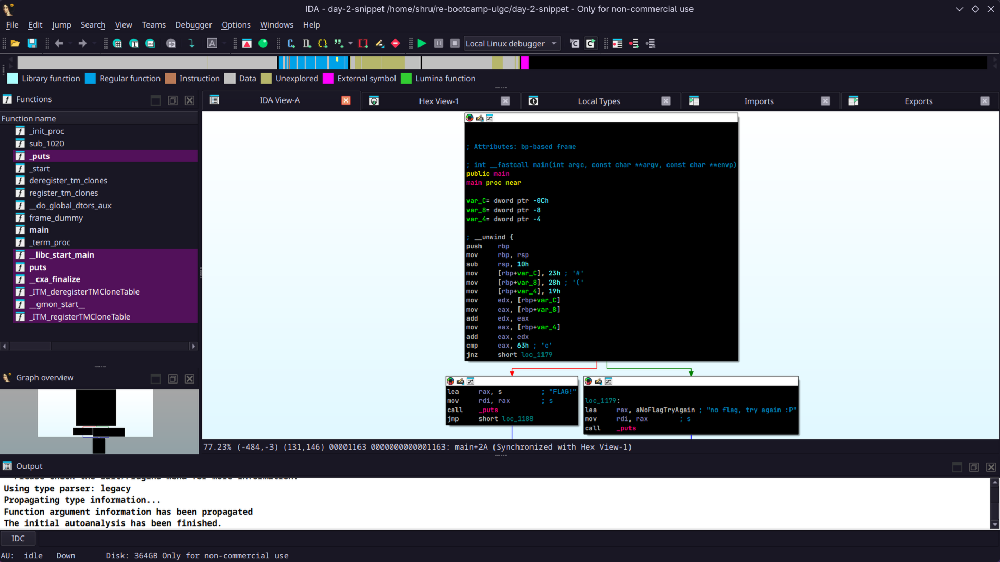
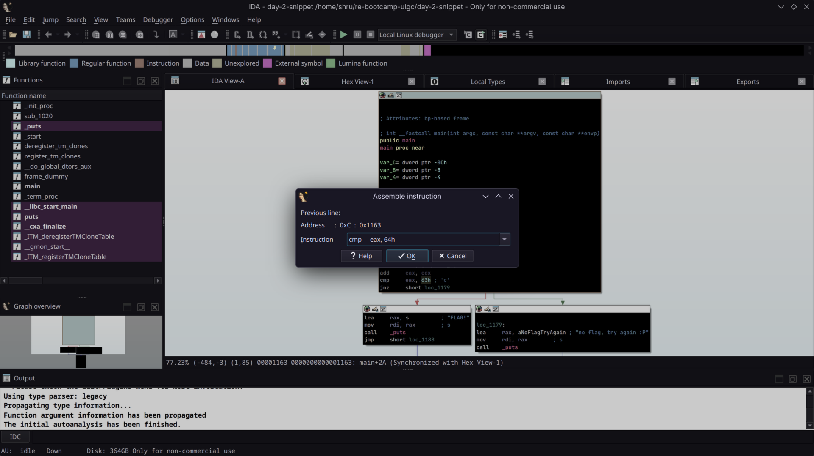
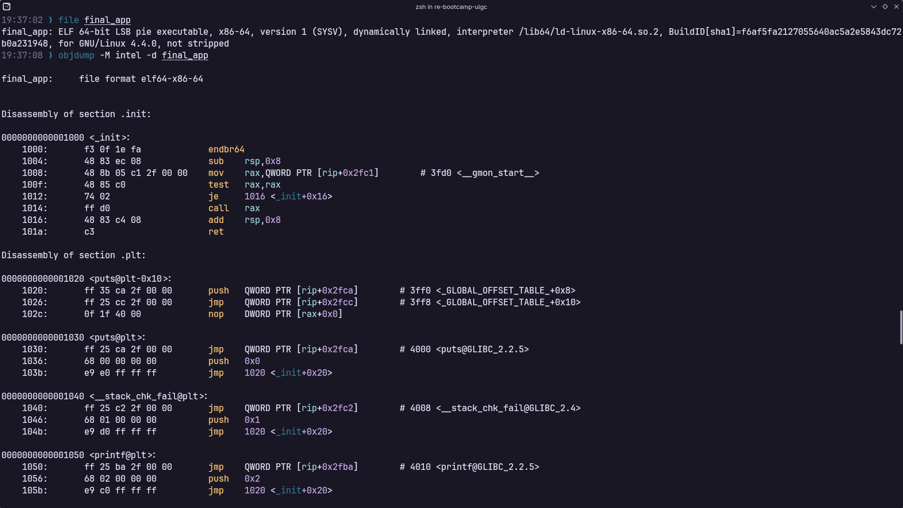
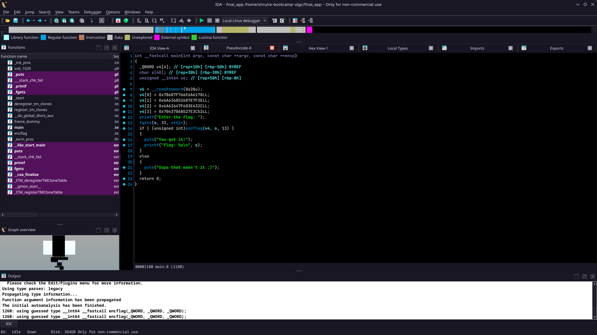
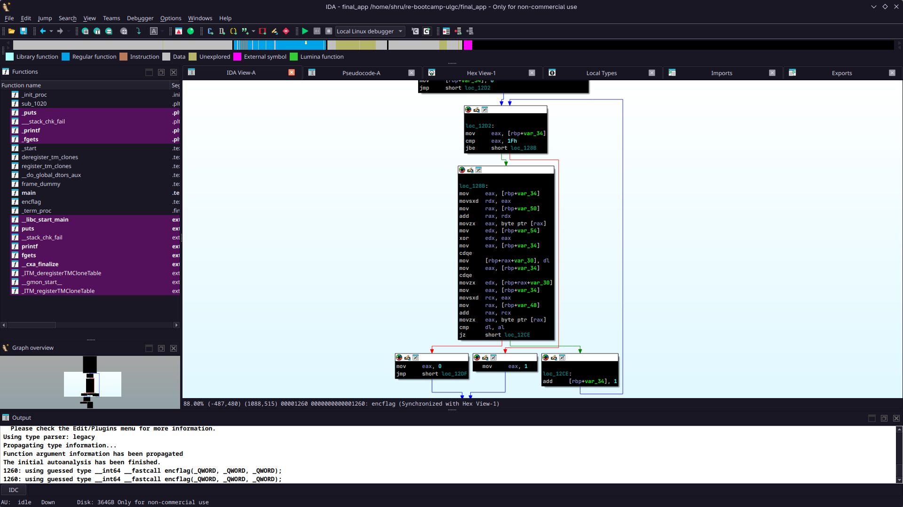

+++
title = "Reverse Engineering Bootcamp"
description = "4-day beginner friendly bootcamp introducing members to the world of Reverse Engineering"
+++

Welcome to the Reverse Engineering Bootcamp hosted by ULGC Cybersecurity Society! Let's disassemble, decompile and debug.


#### When and Where:

**📆 October 7, 2026 - October 10, 2026**<br>
**📍 ULGC Discord Server and Google Meet**

#### What is it:

This bootcamp will teach you to disassemble and debug a binary program to understand it's inner functionality. The Reverse Engineering Bootcamp is beginner friendly and you do not have to be a Computer Science or Cybersecurity student to join. We will go over the theory and practical together so there is something for everybody regardless of background!

#### How it works:

We will host one-hour of live session everyday of the bootcamp. In this live session, we will go over the theory, reasoning and examples of reverse engineering binary programs. We will talk about x86-64 assembly language which you will be dealing with regularly in the field of reverse engineering. We will discuss tools such as Ghidra and IDA. We will also perform live disassembly and debugging with GDB.

After every live session, you will be given a small snippet of code or a theoretical problem to solve. These snippets or problems will be posted here after the session ends.  This will enable you to practice your skills and introduce you to the world of Reverse Engineering with a hands on approach. 

#### What's next:

More information e.g. the links to the live session will be shared ahead of the event. Look out for the announcements in ULGC Discord Cybersecurity Society channel to get the latest updates.

I hope this event will be super exciting and fun, see you all there. 

--- Shruti Priya, Presider


**Important Stuff**<br><br>
Find the live session slides, source code and code snippets on our Github Repository: [https://github.com/cybersec-soc-ulgc/re-bootcamp-ulgc](https://github.com/cybersec-soc-ulgc/re-bootcamp-ulgc)


### DAY 1

We talked about the x86-64 assembly language with an introduction to memory hierarchy and the stack. Following is a code snippet written in x86-64 assembly. Your task is to figure out what this piece of code is doing. Send us your answers in Discord. 

If you are stuck or need further help, ping Shruti (`@ghalibluvr`) on Discord. We will discuss the code snippet and the solution on Day 2. Good luck!

```nasm
.intel_syntax noprefix
.globl _start

_start:
mov	rax, 40
mov	rbx, 20
add	rax, rbx
mov	rdi, 1337
syscall
```

#### Solution

The program is moving the value `40` inside the register `RAX`. Then, the program moves the value `20` inside the register `RBX`. Finally, the program adds those two registers and places the sum in the register `RAX`. `RAX` now contains the value `60`. The program then proceeds to put the value `1337` inside the register `RDI`.

According the Linux/UNIX calling conventions, the `syscall` value should be placed in register `RAX` and the first argument should be in the register `RDI`. In our code snippet, the `syscall` number inside `RAX` is `60` and the first argument inside `RDI` is `1337`. Hence, the program simply exits with the return code `1337`.


### DAY 2

Reverse engineer the following binary and apply patches to make the program print the string `FLAG!`.


**Download the binary here:** [day-2-snippet](https://transfer.it/t/QhJwsClVBDYK)<br>
**MD5 Checksum:** `0e7bee97266008400a627774444a5dc6`



#### Solution

By disassembling the binary in IDA/Ghidra we notice that the program is moving 3 different values in different memory locations. The program then proceeds to add these values together and compare the sum with `0x63` or `99`.



We notice that the three values added together actually equal `0x64` or `100`. Since the comparison always fails, the program never prints the string `FLAG!`. We patch the `CMP` instruction by changing the value from `0x63` to `0x64`.



Now, the `CMP` instruction returns true and we successfully trigger the instruction for printing the string `FLAG!`.


### Day 3

This is the final project for the Reverse Engineering Bootcamp. We will solve this challenge during the final session together. But, you are free to play around with it and find the flag. Download the binary and happy hacking!


**Download the binary here:** [final_app](https://transfer.it/t/KF0VoS0RwDiB)<br>
**MD5 Checksum:** `efad48af8919056b7e8564fc11175ffe`


#### Solution

Looking at the final project with `strings` and `objdump`, we find two functions: `main()` and `encflag()`. After disassembling the binary in IDA, we see that the `main()` function takes some bytes as input and passes them to the `encflag()` function.





In the `encflag()` function, our input is XOR-ed with a value and compared with another value in memory. If the comparison does not return true, the program exits by printing the string `Oops, that wasn't it ;)`. 



By putting all this information together, we understand that our input should pass the comparison check. Since, XOR is a reversible operation, we can find the correct input by XOR-ing the 4 values in the disassembly with the value `0xd`. We use [pwntools](https://docs.pwntools.com/en/stable/) to construct an exploit and get the flag. 

```python
from pwn import *

context.arch = "amd64"

#p = gdb.debug("./final_app", '''
#                b main
#                b encflag
#                ''')
p = process("./final_app")

payload = p64(0x7b687f766e6a6178) + p64(0x6a636852687e7f3e) + p64(0x6a63647f683e632c) + p64(0x7043786b527e3c52)

flag = b''

for i in payload:
    flag += (i ^ 13).to_bytes(1, 'little')

p.send(flag)
p.interactive()
```

