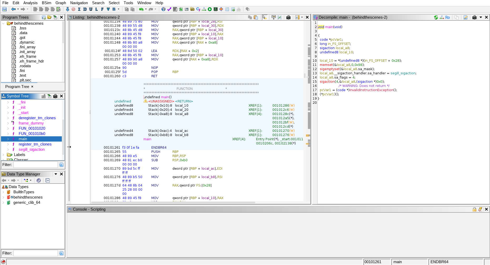
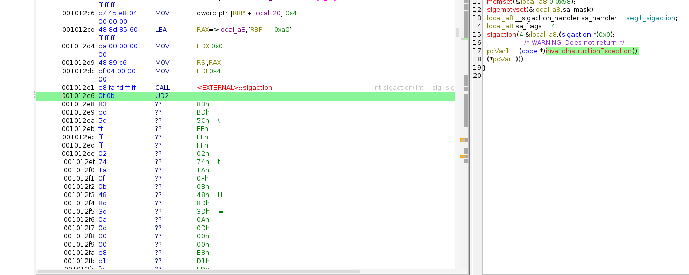
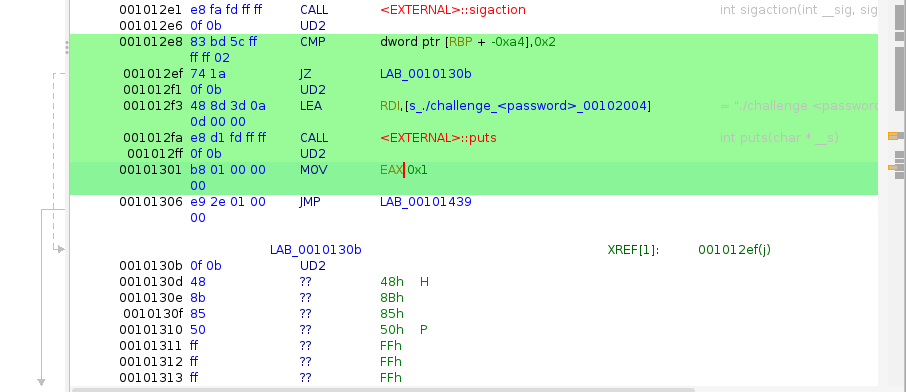

+++
title = 'HTB Writeup: Behind the Scenes'
description = 'Complete Writeup for Hack The Box Reverse Engineering Challenge Behind the Scenes'
draft = false
date = 2025-10-01T07:07:07+01:00
+++

**Author: Shruti Priya**

This is a writeup for the Hack the Box Reverse Engineering Challenge [Behind the Scenes](https://app.hackthebox.com/challenges/Behind%2520the%2520Scenes). This challenge is rated Very Easy and the solution holds true to the rating. Let's dive into disassembling the challenge and finding the flag.

I first disassembled the binary with Ghidra but unfortunately it did not give me much information. Notice the `main` function. It only shows us a `sigemptyset()` function call.



According to IBM C/C++ Runtime Library Reference:

> _sigemptyset() is part of a family of functions that manipulate signal sets. Signal sets are data objects that let a process keep track of groups of signals. For example, a process can create one signal set to record which signals it is blocking, and another signal set to record which signals are pending. Signal sets are used to manipulate groups of signals used by other functions (such as sigprocmask()) or to examine signal sets returned by other functions (such as sigpending())._

During execution, a process can receive several _signals_ e.g. `SIGKILL` to kill the process. The `sigemptyset()` initialises the signal set to be empty. The second function, namely, `sigaction()` will change the process's action based on and when receiving a signal. After these instructions we also have an `InvalidInstructionException()`. When highlighting this line of code, we have an `UD2` instruction in the disassembled assembly code.



In x86 and amd64, the `UD2` instruction raises an [Invalid Opcode Exception](https://www.felixcloutier.com/x86/ud). Ghidra assumes the program will stop due to this exception and does not disassemble further. However, when selecting this code and hitting `D` (for disassembling), there's clearly more code after the `UD2` instruction.



The **Behind the Scenes** challenge page also says _"After struggling to secure our secret strings for a long time, we finally figured out the solution to our problem: Make decompilation harder. It should now be impossible to figure out how our programs work!"_. 

The author has cleverly inserted `UD2` instructions to make decompilation harder. So, what do we do? Ditch Ghidra and go back to good old GDB! But first, let's run the challenge and see what happens.

```bash
$ ./behindthescenes
./challenge <password>
```

So, we need a password. Now, let's disassemble the binary with GDB.

```bash
(gdb) disas main
Dump of assembler code for function main:
   0x0000000000001261 <+0>:	endbr64
   0x0000000000001265 <+4>:	push   rbp
   0x0000000000001266 <+5>:	mov    rbp,rsp
   0x0000000000001269 <+8>:	sub    rsp,0xb0
   0x0000000000001270 <+15>:	mov    DWORD PTR [rbp-0xa4],edi
   0x0000000000001276 <+21>:	mov    QWORD PTR [rbp-0xb0],rsi
   ...SNIP...
   0x000000000000129d <+60>:	mov    rdi,rax
   0x00000000000012a0 <+63>:	call   0x1120 <memset@plt>
   0x00000000000012a5 <+68>:	lea    rax,[rbp-0xa0]
   0x00000000000012ac <+75>:	add    rax,0x8
   0x00000000000012b0 <+79>:	mov    rdi,rax
   0x00000000000012b3 <+82>:	call   0x1130 <sigemptyset@plt>
   ...SNIP...
   0x00000000000012fa <+153>:	call   0x10d0 <puts@plt>
   0x00000000000012ff <+158>:	ud2
   0x0000000000001301 <+160>:	mov    eax,0x1
   0x0000000000001306 <+165>:	jmp    0x1439 <main+472>
   0x000000000000130b <+170>:	ud2
   0x000000000000130d <+172>:	mov    rax,QWORD PTR [rbp-0xb0]
   0x0000000000001314 <+179>:	add    rax,0x8
   0x0000000000001318 <+183>:	mov    rax,QWORD PTR [rax]
   0x000000000000131b <+186>:	mov    rdi,rax
   0x000000000000131e <+189>:	call   0x10f0 <strlen@plt>
   ...SNIP...
   0x000000000000134c <+235>:	call   0x10c0 <strncmp@plt>
   ...SNIP...
   0x000000000000137c <+283>:	call   0x10c0 <strncmp@plt>
   ...SNIP...
   0x00000000000013ac <+331>:	call   0x10c0 <strncmp@plt>
   ...SNIP...
   0x00000000000013d8 <+375>:	call   0x10c0 <strncmp@plt>
   0x00000000000013dd <+380>:	test   eax,eax
   0x00000000000013df <+382>:	jne    0x140e <main+429>
   0x00000000000013e1 <+384>:	ud2
   ...SNIP...
   0x0000000000001432 <+465>:	ud2
   0x0000000000001434 <+467>:	mov    eax,0x0
   0x0000000000001439 <+472>:	mov    rcx,QWORD PTR [rbp-0x8]
   0x000000000000143d <+476>:	xor    rcx,QWORD PTR fs:0x28
   0x0000000000001446 <+485>:	je     0x144d <main+492>
   0x0000000000001448 <+487>:	call   0x1100 <__stack_chk_fail@plt>
   0x000000000000144d <+492>:	leave
   0x000000000000144e <+493>:	ret
```

Notice how there are 4 `strncmp()` function calls. This means the program is comparing 4 different strings. Let's add a breakpoint and run the challenge so we can see **_what_** are those strings.

```bash
(gdb) b main
Breakpoint 1 at 0x1269
(gdb) run
Starting program: /home/sapphicart/htb/Behind the Scenes/rev_behindthescenes/behindthescenes 
[Thread debugging using libthread_db enabled]
Using host libthread_db library "/lib/x86_64-linux-gnu/libthread_db.so.1".

Breakpoint 1, 0x0000555555555269 in main ()
```

Now, there's actual memory addresses for the comparable strings. Let's look at all four of them.

```bash
(gdb) x/s 0x55555555601b
0x55555555601b:	"***"
(gdb) x/s 0x55555555601f
0x55555555601f:	"***"
(gdb) x/s 0x555555556023
0x555555556023:	"***"
(gdb) x/s 0x555555556027
0x555555556027:	"***"
```

YAY! Some actionable information, all four are ASCII strings. Let's go back to the disassmbly and look at the `strlen()` function.

```bash
   0x000055555555531e <+189>:	call   0x5555555550f0 <strlen@plt>
   0x0000555555555323 <+194>:	cmp    rax,0xc
```

The program is comparing `rax` with `0xc` which is 12 bytes. Also note that the four strings are 3 bytes each, so 12 bytes in total. I am pretty sure the password is a concatenation of these 4 strings. Let's try it and see.

```bash
$ ./behindthescenes ************
> HTB{************}
```

Et voila! The password was correct and the flag is just a cocatenation of the password and the string `HTB{}`. This solves the **Behind the Scenes** challenge. I learnt about Invalid Opcode `UD2` and how it can be used to throw hackers off the trail. The great lord GDB comes to the rescue. Still, one must have in-depth knowledge of Assembly Code to understand and Reverse Engineer a GDB disassembly. 